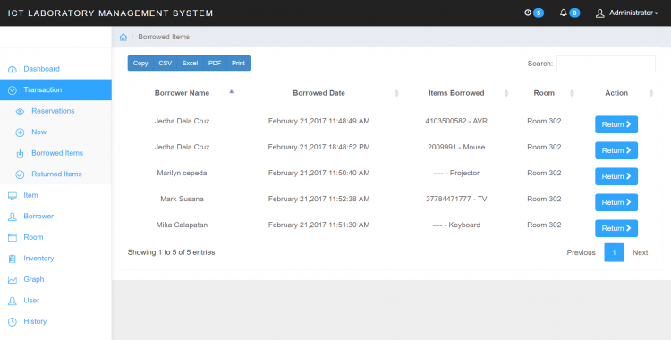

# ICT Laboratory Management System using PHP/PDO

### Features

<ul>
  <li>Transactions Management
    <ul>
        <li>Reservation</li>
        <li>Borrowed Items</li>
        <li>Returned Items</li>
      </ul>
  </li>
  <li>Item</li>
  <li>Borrower</li>
  <li>Inventory</li>
  <li>Graph</li>
  <li>History</li>
</ul>
<strong>Members</strong>
<ul>
  <li>Reservation</li>
</ul>

Visit [sourcecodester.com](https://www.sourcecodester.com/php/11256/ict-laboratory-management-systme.html) for more detailed information about this Laboratory Management System Project in PHP/PDO.

| Title | ICT Laboratory Management System using PHP/PDO with Source Code |
|:--|:--|
| Website | [www.sourcecodester.com](https://www.sourcecodester.com) |
| Link | https://www.sourcecodester.com/php/11256/ict-laboratory-management-systme.html |
| Language | PHP |
| Uploader/Developer | [kevind](https://www.sourcecodester.com/users/kevind) |
